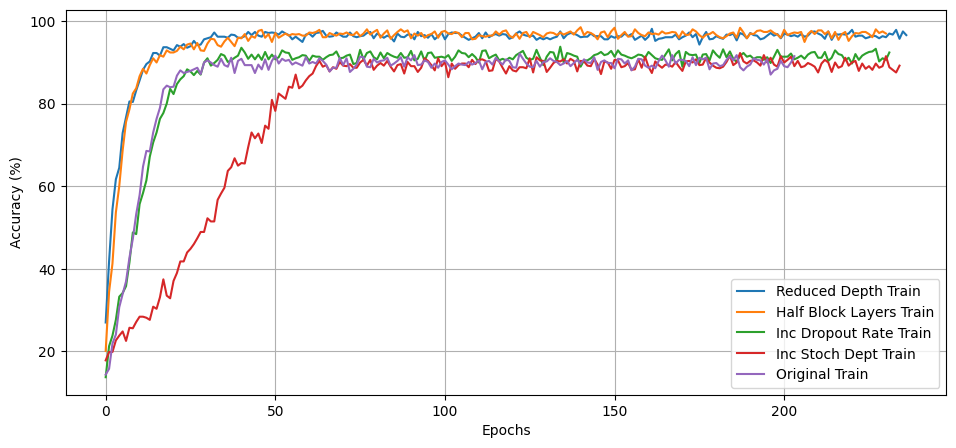
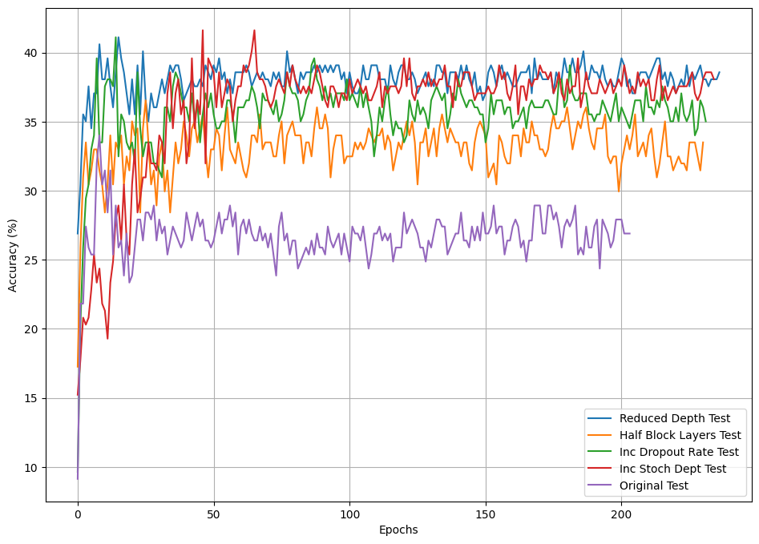
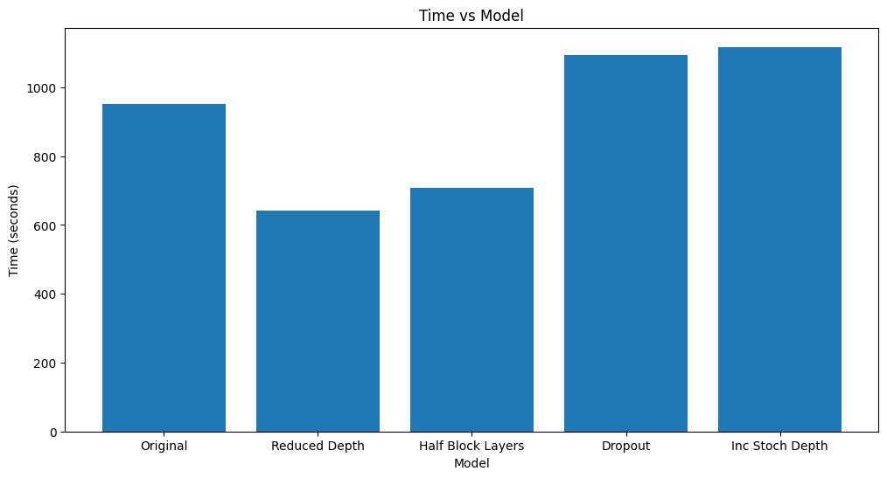

# EfficientNetV2: Smaller Models and Faster Training by Mingxing Tan, Quoc V. Le

## Introduction

## Authors

The authors of this blog post are:

- Nishant Aklecha (n.aklecha@student.tudelft.nl) [5693357]
- Mirijam Zhang (s.x.zhang@student.tudelft.nl) [4660129]
- Jahson O'Dwyer Wha Binda (j.t.odwyerwhabind@student.tudelft.nl) [4772288]

## Paper summary

## Reproduction

The EfficientNetV2 model is available on PyTorch [1]. There are three EfficientNetV2 architectures, EfficientNetV2-S, EfficientNetV2-M, and EfficientNetV2-L. For this reproduction project, EfficientNetV2-S is used as it is a smaller model that uses less parameters and will thus be faster.

PyTorch includes pretrained weights with the model. However, by default, no pre-trained weights are used.

### New data

The new dataset that we chose to train and test is the '25 Indian bird species with 226k images' [2]. The images are resized to 32x32 and 128x128 and trained and tested on both sizes.

### Reproduced

#### Training and testing with no weights

#### Testing the model with pre-trained weights

For reproduction of the results, the pretrained weights, EfficientNet_V2_S_Weights.DEFAULT, [3] were used. These weights improve upon the results of the original paper by using a modified version of TorchVision’s new training recipe.

Before using the pre-trained models, the images must be preprocessed (resize with right resolution/interpolation, apply inference transforms, rescale the values etc). A preprocessing transforms function is included in the model weight.

The transform function for EfficientNet_V2_S can be called as follows: `EfficientNet_V2_S_Weights.DEFAULT.transforms()`. The function accepts: PIL.Image, batched (B, C, H, W) and single (C, H, W) image torch.Tensor objects. It performs the following operations: The images are resized to resize_size=[384] using interpolation=InterpolationMode.BILINEAR, followed by a central crop of crop_size=[384]. Finally the values are first rescaled to [0.0, 1.0] and then normalized using mean=[0.485, 0.456, 0.406] and std=[0.229, 0.224, 0.225]. [2]

### Hyperparameter check

EfficientNetV2 is a state-of-the-art model known for its efficiency and performance in image classification tasks. In this section, we will conduct an in-depth analysis of the model by exploring various hyperparameters and their impact on the model's accuracy and training speed. We will use the 25-Indian-bird-species dataset with 226k images transformed to 32x32, and the ImageNet dataset with two different resolutions: 32x32 and 128x128. Due to memory constraints, we used only 100 training examples per class, which led to lower accuracy and overfitting issues. Even though, the insights gleaned from this analysis will help us understand the model's behavior better.

The following hyperparameters were tested:

**Depth multiplier of MBConv layers (0.1):** The depth multiplier controls the number of filters in the MBConv layers, which are the core building blocks of EfficientNetV2. Reducing the depth multiplier to 0.1 means we are compressing the model by decreasing its complexity. This will likely result in faster training times but could potentially degrade the model's accuracy.

**Reducing the number of layers in all convolutional layers by half:** This will reduce the overall model complexity, which might lead to faster training times but could also lower the model's capacity to learn complex features, potentially impacting its accuracy.

**Increasing dropout rate (0.2 to 0.6):** Dropout is a regularization technique that helps prevent overfitting by randomly dropping out neurons during training. By increasing the dropout rate, we expect the model to be more robust to overfitting, but it may also increase training times as the model will require more epochs to converge.

**Increasing stochastic depth probability (0.5):** Stochastic depth is another regularization technique that helps mitigate overfitting by randomly dropping out entire residual connections during training. A higher probability increases the chance of dropout, potentially improving generalization but also increasing training times due to slower convergence.

**Modifying the training loop to use a ReduceLROnPlateau scheduler:** This scheduler adjusts the learning rate based on the model's performance on the validation set. If the performance plateaus, the learning rate is reduced to help the model converge to a better local minimum. Using this scheduler might result in improved accuracy, but it could also increase training times due to the additional epochs needed for convergence.

By comparing the effects of these hyperparameters on the model's accuracy and training speed, we will gain a deeper understanding of EfficientNetV2 and how to fine-tune it for specific applications. We trained each scenario for a minimum of 150 epochs, after which early stopping may happen if there is no improvement for 50 epochs.

As expected with only 100 training examples for each class our models have overfit, though due to the nature of our changes we simplify the model so at times we can actually see some gains.

### Results

Below are the graphed results for the imageNet 128x128 dataset, for others please see the jupyter notebook in our code.



Figure: Training Accuracies of ImageNet 128x128.



Figure: Testing Accuracies of ImageNet 128x128.



Figure: Train times of ImageNet 128x128.

### Depth multiplier of MBConv layers (0.1):

#### Findings

Our findings reveal that using a depth multiplier of 0.1 in MBConv layers led to interesting results. For the 32x32 models, the training accuracy reached its peak faster, and the test accuracy showed a slight but insignificant improvement. On the other hand, for the 128x128 models, the training accuracy also peaked faster, while the test accuracy improved by about 10%.

#### Analysis

The quicker convergence in training accuracy for both resolutions could be attributed to the reduced model complexity. With fewer filters in the MBConv layers, the model had fewer parameters to learn, leading to faster training times. This reduction in complexity, however, might have limited the model's ability to learn intricate features, which could explain the minimal improvement in test accuracy for the 32x32 models.

The more significant improvement in test accuracy for the 128x128 models could be due to the larger input size, which allowed the model to better capture and learn complex features despite having a reduced number of filters. This demonstrates that the EfficientNetV2 model's performance is sensitive to both its architecture and the input resolution, highlighting the importance of balancing model complexity with the input size for achieving optimal results.

### Reducing the number of layers in all convolutional layers by half:

#### Findings

Our experiment with reducing the number of layers in all convolutional layers by half yielded some unexpected results. For the ImageNet 32x32 dataset, the test accuracy was worse after the change compared to the original model. However, for the 128x128 dataset, the test accuracy improved by about 5% on average.

When not using the ReduceLROnPlateau scheduler, the differences between the models seemed insignificant. This was contrary to our expectations, as we assumed that reducing the number of layers would have a similar effect as the depth multiplier of MBConv layers since both modifications reduce model complexity.

#### Analysis

The contrasting results between the 32x32 and 128x128 datasets could be due to the differences in input resolution. With smaller input sizes (32x32), the reduction in layers might have limited the model's ability to capture and learn complex features, leading to a decrease in test accuracy. On the other hand, the 128x128 dataset allowed the model to better learn intricate features despite having fewer layers, which contributed to the improved test accuracy.

The absence of significant differences between the models when not using the scheduler suggests that the learning rate plays a crucial role in optimizing the model's performance. This highlights the importance of fine-tuning both the model's architecture and its training process to achieve the desired balance between complexity and efficiency.

This points to the idea that reducing the number of layers in all convolutional layers by half had varying effects on the EfficientNetV2 model's performance depending on the input size and the presence of a learning rate scheduler. Further investigation is necessary to understand the underlying reasons for these results and to determine the optimal configuration for different applications

### Increasing dropout rate (0.2 to 0.6):

#### Findings

When we increased the dropout rate from 0.2 to 0.6, we observed that without the scheduler, there was no significant change in model performance. In the case of the bird dataset, the test accuracy dropped by about 3%. For the ImageNet dataset, we noticed a slight increase in test accuracy of about 2% for the 32x32 resolution and a more substantial increase of around 10% for the 128x128 resolution, which seems to be a recurring pattern for these two input sizes.

#### Analysis

The absence of significant changes in model performance without the scheduler might indicate that the learning rate plays a crucial role in the effectiveness of dropout as a regularization technique. The drop in test accuracy for the bird dataset could be attributed to the increased dropout rate leading to a loss of essential features during training. This suggests that a higher dropout rate may not always be beneficial for smaller datasets, as it might hinder the model's ability to learn critical patterns.

On the other hand, the improvements in test accuracy for the ImageNet dataset, especially with the 128x128 resolution, might be due to the increased dropout rate's ability to prevent overfitting more effectively. This demonstrates that a higher dropout rate could be advantageous for larger and more diverse datasets, as it allows the model to generalize better.

It seems that for larger and more diverse datasets, such as the ImageNet 128x128 dataset, increasing the dropout rate (e.g., from 0.2 to 0.6) has been shown to improve test accuracy, as it helps prevent overfitting and enhances the model's generalization ability.

### Increasing stochastic depth probability (0.5):

The lack of significant changes in model performance without the scheduler suggests that the learning rate plays a crucial role in determining the effectiveness of stochastic depth as a regularization technique. The substantial decrease in test accuracy for the ImageNet 32x32 dataset could be due to the higher stochastic depth probability resulting in the loss of important features during training. This might indicate that a higher stochastic depth probability is not always beneficial, especially for smaller input sizes, as it may prevent the model from learning critical patterns.

Conversely, the increase in test accuracy for the 128x128 dataset might be attributed to the higher stochastic depth probability's ability to prevent overfitting more effectively. This demonstrates that a higher stochastic depth probability could be advantageous for larger input sizes, as it allows the model to generalize better.

Increasing the stochastic depth probability seems to have had varying effects on the EfficientNetV2 model's performance depending on the input size.

### Summary

In our experiments with various hyperparameters on the EfficientNetV2 model, we observed the following trends:

1. Training accuracy for the original models and those with an increased dropout rate were similar. However, for models with increased stochastic depth, it took longer to reach the accuracy of the original and increased dropout models. In contrast, the models with reduced depth and fewer layers in the convolution blocks experienced faster convergence and higher training accuracy.

2. Test accuracy exhibited a consistent pattern depending on the input resolution. On average, the test accuracy increased for higher resolution images and decreased for lower resolution ones.

3. Among all the models, the one with reduced depth trained the fastest. The other models' training speeds were generally close to the original model.

4. The use of a changing learning rate using a scheduler, generally increased the accuracy of our models on the test sets.

From our exploration of various hyperparameters and their effects on the EfficientNetV2 model, we have gained valuable insights into its behavior and performance. Our findings highlight the model's sensitivity to input resolution, learning rate, and architectural changes. The experiments demonstrated that reducing complexity, either through depth reduction or decreasing the number of layers in convolution blocks, can lead to faster training times while maintaining reasonable accuracy levels, particularly for higher resolution inputs.

The results also emphasized the importance of regularization techniques, such as dropout and stochastic depth, in preventing overfitting and improving generalization. However, the effectiveness of these techniques is influenced by factors such as dataset size, input resolution, and learning rate scheduling. In conclusion, EfficientNetV2 is a versatile and powerful model whose performance can be fine-tuned through careful consideration and adjustment of hyperparameters, input size, and training strategies to achieve optimal results in various applications.

### Hyperparams Check

### Ablation Study

When performing abaltion studies, the most interesting components for investigation are the ones that contribute significantly to the model's performance. EfficientNetV2 is a state-of-the-art model that is designed to achieve high accuracy while minimizing computational cost.

To understand the components that contribute most to EfficientNetV2's performance, one might conduct an ablation study to investigate the impact of various architectural components, such as the number of layers or the size of the bottleneck layers.

Specifically, we will be exploring whether the proposed configuration mentioned in the literature can be modified to reduce the size of the model or simplify the architecture. By systematically removing or modifying components of the model, we will be able to determine the impact of each component on the overall performance of the model. This will allow us to gain a deeper understanding of the mechanisms underlying the success of the EfficientNetV2 model and evaluate the relevance of the proposed configuration. Ultimately, the results of this study will provide valuable insights into the design of efficient and effective models for computer vision tasks.

Please refer to the default EfficientNetv2 architecture give below to understand for later ablation modifications:

```
default_architecture = [
    FusedMBConvConfig(1, 3, 1, 24, 24, 2),
    FusedMBConvConfig(4, 3, 2, 24, 48, 4),
    FusedMBConvConfig(4, 3, 2, 48, 64, 4),
    MBConvConfig(4, 3, 2, 64, 128, 6),
    MBConvConfig(6, 3, 1, 128, 160, 9),
    MBConvConfig(6, 3, 2, 160, 256, 15),
]
```

#### Replacing the FusedMBConv layers with MBConv layers

```
modified_architecture = [
    MBConvConfig(1, 3, 1, 24, 24, 2),
    MBConvConfig(4, 3, 2, 24, 48, 4),
    MBConvConfig(4, 3, 2, 48, 64, 4),
    MBConvConfig(4, 3, 2, 64, 128, 6),
    MBConvConfig(6, 3, 1, 128, 160, 9),
    MBConvConfig(6, 3, 2, 160, 256, 15),
]
```

FusedMBConv layers are a key component of the EfficientNetV2 architecture, and are designed to reduce the computational cost of the model while maintaining high accuracy.

By replacing the FusedMBConv layers with standard MBConv layers, we sought to determine the impact of this component on the model's performance. We hypothesized that removing the FusedMBConv layers would increase the computational cost of the model but may also lead to higher accuracy due to the increased expressive power of the standard MBConv layers.

As for the expected outcome of this ablation study, we anticipated that the accuracy of the modified model would decrease slightly due to the increased computational cost. However, we also expected that the modified model would still achieve relatively high accuracy, as the MBConv layers are a powerful building block in deep learning models. Ultimately, the results of this ablation study would provide valuable insights into the relative importance of the FusedMBConv layers and inform the design of future models for computer vision tasks.

#### Replacing the MBConv layers with FusedMBConv layers

```
modified_architecture = [
    FusedMBConvConfig(1, 3, 1, 24, 24, 2),
    FusedMBConvConfig(4, 3, 2, 24, 48, 4),
    FusedMBConvConfig(4, 3, 2, 48, 64, 4),
    FusedMBConvConfig(4, 3, 2, 64, 128, 6),
    FusedMBConvConfig(6, 3, 1, 128, 160, 9),
    FusedMBConvConfig(6, 3, 2, 160, 256, 15),
]
```

To explore the importance of these MBConv layers, we replaced them with FusedMBConv layers, which offer a more computationally efficient alternative. Our aim was to understand how this change impacted the performance of the model, with a particular focus on whether it would affect accuracy due to the reduced expressive power of the FusedMBConv layers.

Our hypothesis was that substituting MBConv layers with FusedMBConv layers would lead to a reduction in the computational cost of the model, but might also cause a decrease in accuracy due to the modified architecture. We anticipated that the model would still achieve relatively high accuracy with the FusedMBConv layers, as they are designed to be more efficient while retaining accuracy.

#### Half the Number of Layers

```
modified_architecture = [
    FusedMBConvConfig(1, 3, 1, 24, 24, 1),
    FusedMBConvConfig(4, 3, 2, 24, 48, 2),
    FusedMBConvConfig(4, 3, 2, 48, 64, 2),
    MBConvConfig(4, 3, 2, 64, 128, 3),
    MBConvConfig(6, 3, 1, 128, 160, 4),
    MBConvConfig(6, 3, 2, 160, 256, 7),
]

```

Our hypothesis was that reducing the number of layers in the small EfficientNetV2 model would lead to a decrease in model complexity and computational cost, but might also result in a reduction in accuracy. However, we also believed that the simplified model might be easier to train and have faster inference times.

As for the expected outcome, we anticipated that the simplified model would have a lower computational cost and be faster to train, but that it might have a slightly lower accuracy compared to the original model due to the reduced number of layers.

Our findings from this ablation study would offer valuable insights into the trade-offs between model complexity, computational cost, training time, and model accuracy in the design of efficient deep learning models for computer vision tasks.

<<<<<<< HEAD
#### Dropped one layer configs for both MBConv and FusedMBConv layers
=======
#### Dropped two configs from the model layers

>>>>>>> 3bd8560c67a31ff687f107e1648c21fb8cc4176d
For this ablation study, we decided to modify the default layer configuration of the small EfficientNetV2 model. Specifically, we reduced the number of layers from the default configuration shown below.

We expected that the modified model would have a lower computational cost and faster training and inference times compared to the default model, while maintaining a comparable level of accuracy. Our findings from this ablation study would help in guiding the design of efficient deep learning models for computer vision tasks, and provide insights into the trade-offs between model complexity, computational cost, and model accuracy.

```
modified_architecture = [
    FusedMBConvConfig(1, 3, 1, 24, 48, 2),
    FusedMBConvConfig(4, 3, 2, 48, 64, 4),
    MBConvConfig(4, 3, 2, 64, 128, 6),
    MBConvConfig(6, 3, 2, 128, 256, 15),
]
```

#### Results of Ablation study

Please find accuracy graphs from the three different datasets that we evaluated on:

##### ImageNetTE dataset


##### MNIST dataset


##### 25-indian-bird-species-with-226k-images dataset


#### Conclusion of Ablation Study

Results of the ablation study can vary based on the specific modifications made to the model. In this case, the results show that certain modifications can lead to improvements in accuracy, while others may result in reduced performance.

For example, in the MNIST dataset, all variations except "only using MBConv layers" reached 99% accuracy, which indicates that the modifications did not significantly impact the model's ability to classify the images correctly. However, the "only using MBConv layers" variation had lower train accuracy and converged slower, which suggests that the model's capacity was not enough to learn the features of the dataset.

On the other hand, in the birds dataset, the train accuracies swiftly increased for all variations, but the test accuracy was highest for "only using FusedMBConv layers" and "dropping one of each layer worked" variations. This may indicate that the modifications helped the model learn the features of the dataset more efficiently. However, the test accuracies seemed to stagnate and not increase after epoch 10 (unlike the train accuracies which were 99%), which could suggest overfitting.

In general, modifications that reduce the computational cost of the model while maintaining or improving accuracy are desirable. However, if the modifications are too drastic or reduce the model's expressive power, they may result in reduced performance. It is also important to monitor for overfitting, as the model may perform well on the training data but not generalize well to unseen data. We observed overfitting during our training process as seen in the graphs, this was due to small dataset subsets we used as we were limited in our resouces and time.
## References

1: https://pytorch.org/vision/main/models/efficientnetv2.html

2: https://www.kaggle.com/datasets/arjunbasandrai/25-indian-bird-species-with-226k-images

3: https://pytorch.org/vision/main/models/generated/torchvision.models.efficientnet_v2_s.html#torchvision.models.EfficientNet_V2_S_Weights
